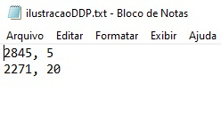
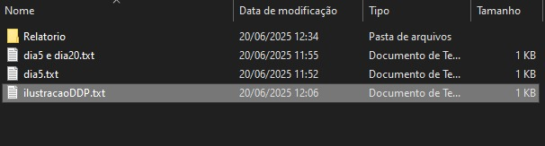
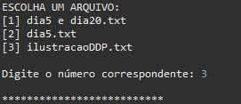
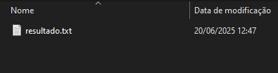
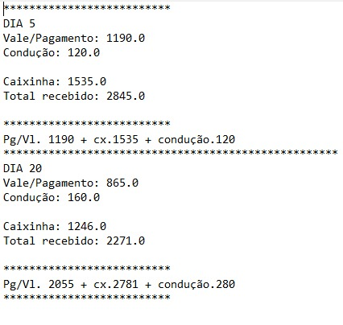

# 💰 Gerador de Relatório de Pagamento

> Projeto pessoal baseado na **Seção 15: Trabalhando com Arquivos**, do professor [Nélio Alves](https://github.com/nelioalves).  
> O objetivo foi consolidar os conhecimentos adquiridos com um sistema funcional de leitura e geração de relatórios.

---

## 🧠 Motivação

Com o tempo, percebi a dificuldade de entender os valores que recebia mensalmente — como pagamento no dia 5, vale no dia 20, além da caixinha e condução, que variam a cada período.  
Por isso, desenvolvi este sistema que organiza e retorna, separadamente, os valores referentes a cada módulo de recebimento.

---

## ⚙️ Execução

### 📥 Arquivo de entrada

📁 O programa lê arquivos contendo o **valor total** recebido e o **dia** correspondente.  
Você deve selecionar o arquivo desejado no diretório configurado.

 

### 📂 Diretório monitorado

Todos os arquivos devem estar neste diretório:

---

### 🖥️ Leitura no console - Parte 1

---

### 📄 Geração do relatório

Após a leitura, um relatório `.txt` é gerado com todas as informações organizadas.

---

## ✅ Resultado final

### 📃 Relatório gerado:

 

### 🖥️ Console - Parte 2

---

## ⚠️ Aviso

📝 **Este sistema utiliza valores simbólicos apenas para fins de demonstração e testes. Nenhuma informação representa remuneração real.**

---

## 🛠️ Tecnologias Utilizadas

- Java
- Eclipse IDE
- Git & GitHub

---

## 📚 Conceitos Aplicados

- Programação Orientada a Objetos (POO)
- Coleções (Listas)
- Manipulação de Arquivos
- Estruturas de Controle (`for`, `while`)
- Tratamento de Exceções

---

