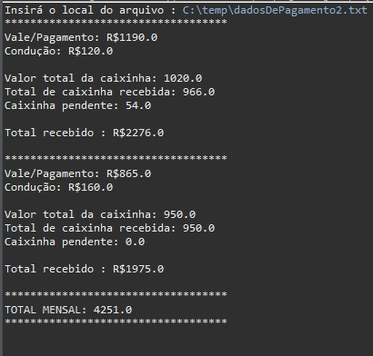

# Gerador de relatório de pagamento 
**Com base na aula "Seção 15: Trabalhando com arquivos" do professor Nelio Alves, criei esse pequeno projeto pessoal:**
Pensando na dificuldade que eu tinha para entender de fato tudo que eu recebia no meu trabalho, desenvolvi um pequeno sistema que faz a leitura de um arquivo .txt com os valores recebidos, me retornando um relátorio detalhando os dados de pagamento:

