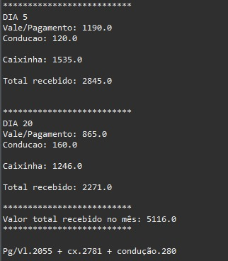

# Gerador de relatório de pagamento 
**Com base na aula "Seção 15: Trabalhando com arquivos" do professor Nelio Alves, desenvolvi esse pequeno projeto pessoal:**

Pensando na dificuldade que eu tinha para entender de fato tudo que eu recebia de pagamento no meu trabalho, desenvolvi um pequeno sistema que faz a leitura de um arquivo .txt com os valores recebidos, me retornando um relátorio detalhando os dados de pagamento:

**Dados a ser lidos:** 

 Os pagamentos são separados da seguinte forma(pagamento/vale, condução, caixinha total, caixinha recebida na conta, e por fim a caixinha recebida em espécie)

 **Diretório utilizado para fazer a leitura dos arquivos:**

 

 **Console pt1: leitura dos arquivos**
 

O programa lê todos os arquivos do diretório mencionado anteriormente, no qual o usuário deverá selecionar o arquivo de sua preferência

 **Console pt2: resultado**
 

 
Tecnologias : Eclipse IDE, Git e Git Hub

Conceitos utilizados : POO, coleções(listas), leitura de arquivos, tratamento de exceções e estruturas de controle(for, while).

